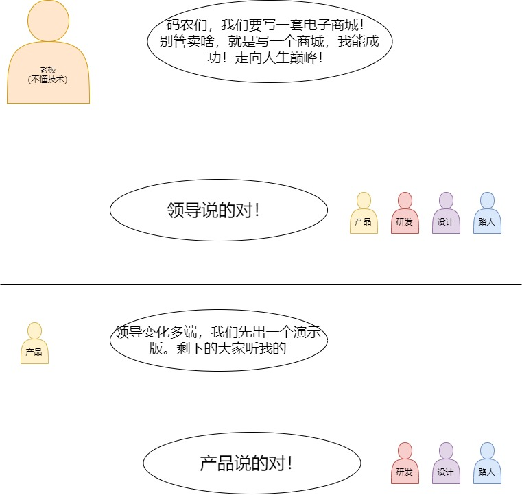
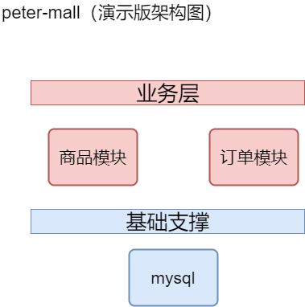

# peter-mall
## 前言
讲真的，19年在互联网寒冬的时候从原来的公司跳槽，以为会拥抱新的天地，但是现在想想真的是可悲，我并没有看到太阳，反而是降薪工
作的寒冷。目前的项目，怎么说呢，非常的年迈，年迈的程度就是，一个分页查询能有好几种的写法（手动狗头）。

某天，忽然灵关乍现，想用springCloud写点什么，因为不写点什么，我真的都忘记了，但是又不知道写什么，就用自己的想法写一套商城的
后台吧。为什么是商城的后台，
因为我是后台。

## 命名
有一次面试，面试官问我让你架构一套分布式系统你打算怎么做，我毫不犹豫的说：*“想名字”*，然后就没有然后了，讲真的
我每次真的都是先想名字，难道有错吗？

这次想写的是一套分布式的商城系统，我打算叫peter-mall。别问为啥，就是任性。
## 开始

### 演示版
#### 需求

#### 架构设计

